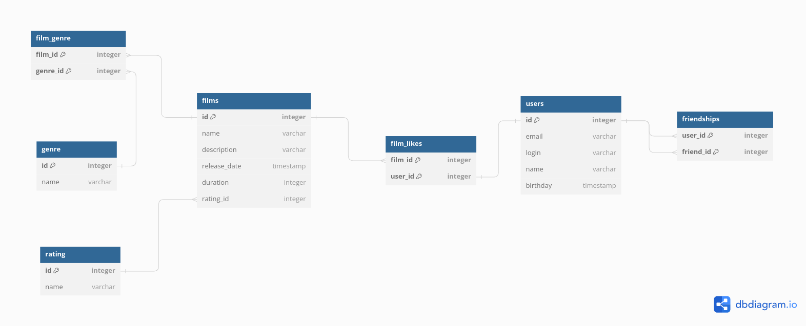

# java-filmorate
Template repository for Filmorate project.
## Database scheme

### Queries example
Фильмы с их названиями жанров и рейтингом:
```
select f.name, g.name, r.name
from films f
    join film_genre fg on fg.film_id = f.id
    join genre g on g.id = fg.genre_id
    join rating r on r.id = f.rating_id
; 
```
Количество лайков у каждого фильма:
```
select f.name, count(*)
from films f
    join film_likes fl on fl.film_id = f.id
group by f.name
;
```
Вывести фильмы, которым пользователь поставил лайк:
```
select f.name
from films f
    join film_likes fl on fl.film_id = f.id
    join users u on u.id = fl.user_id
where u.id = ? or u.name like '%?%'
;
```
Показать друзей определеного пользователя:
```
select u.name
from users u
    join friendships fs on fs.friend_id = u.id
where u.id = ? or u.name like '%?%'
;
```